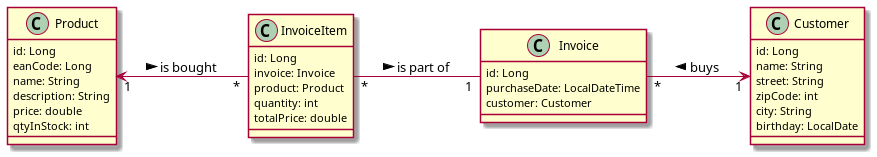
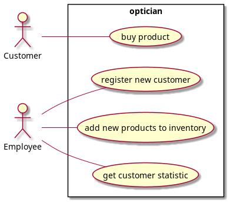

# Optician, Eichhorn M.
 
This project represents an opticians business.
The optician sells products (glasses, lenses, ...).
Every customer is stored and every invoice belongs to 1 customer.
He can add new products to his inventory. He can also analyze his sales 
(See Use-Case-Diagram 3. for more information).

## Pull request documentation 
Go to the gh-pages to find the documentantion on how to 
create / review a pull request:
[Github-pages](https://2122-5ahif-nvs.github.io/02-microproject-MoritzEichhorn/#_github_pull_request_documentation)

## Web sockets
If you go to http://localhost:8080/api/ you can "log in" (just enter some name and press `connect`).
After that you can order some Products (we only have products that have `glasses` or `contacts` in their name).
After that the order is being processed (program waits 0 - 5 seconds). Then you will get
an answer, either that your product is ready, or that we do not own that product.

## Feature branches
### get-product-information
Implemented feature: You can get the full information of a product (price, quantityInStock, eanCode, ...)
here: `GET /api/products/{id}`

### add-purchase-history
Implemented feature: Endpoint, where you can see all the purchases (product name, total price, quantity, purchase date) 
made by a customer:
`GET /api/customers/getHistory/1`

## API Documentation

When you run the application, you can find the documentation of the api here

<http://localhost:8080/api/q/swagger-ui>

## Class-Diagram




## Use-Case-Diagram



1. As an employee I want to be able to register new customers.
2. As a customer I want to be able to buy products.
3. As an employee I want to be able to get a statistic over a given period,
   which shows how many different customers we had, how many products
   were sold during this period and how much the products cost on
   average.
4. As an employee I want to be able to add new products to the inventory.


## Tests

I created tests for all entities, repositories and endpoints.
Regarding testing in karate I tested one endpoint in this project (InvoiceResourceTest).

## Running the application

First you'll need to start the database. You can do this by starting the docker-compose:


```shell script
docker-compose up -d
```

You can run your application using:

```shell script
./mvnw clean quarkus:dev
```

## Testing

You can test your application by running the tests in your IDE or by executing
following command:

```shell script
./mvnw test
```